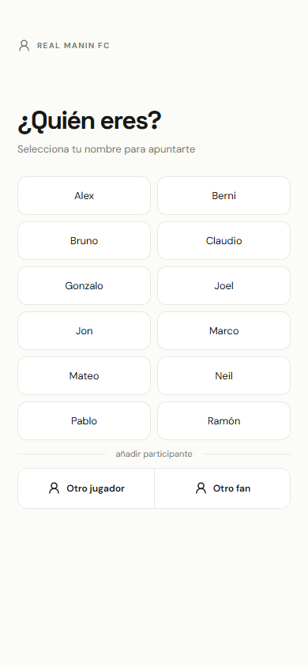
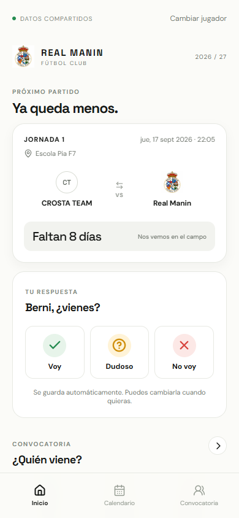
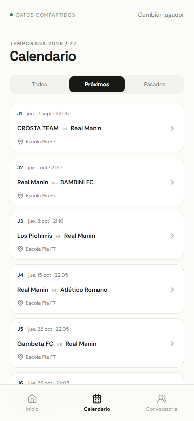
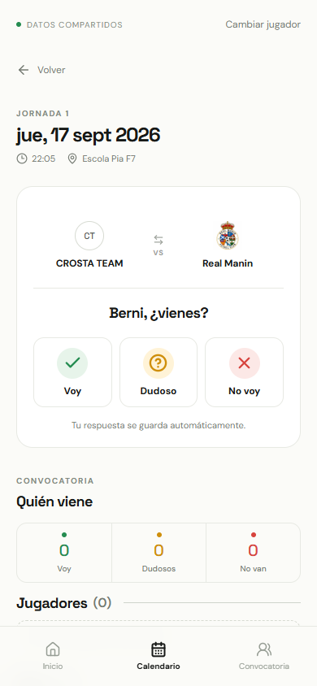
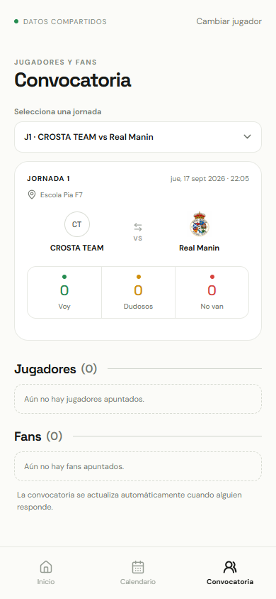

# Real Manin FC

[](https://github.com/bnovelorotger/real-manin-fc/actions/workflows/deploy.yml)
[](https://bnovelorotger.github.io/real-manin-fc/)

Aplicación mobile-first para saber cuándo juega Real Manin FC y quién viene a cada partido.

La app permite seleccionar jugador, consultar el calendario real de la temporada, responder `Voy`, `Dudoso` o `No voy` y ver la convocatoria separada entre **Jugadores** y **Fans**. Las respuestas se comparten entre dispositivos mediante Supabase.

## El prototipo

Real Manin FC nace como un prototipo de herramienta para facilitar la vida diaria de equipos de fútbol base, jugadores y entrenadores. Su objetivo es convertir una tarea normalmente dispersa —preguntar quién viene, recordar horarios y preparar cada partido— en una experiencia sencilla, visual y compartida.

La propuesta no se limita a organizar información: al hacer muy fácil confirmar la asistencia, ayuda a aumentar la participación, reduce la incertidumbre antes de cada jornada y fomenta una cultura de equipo más conectada. Jugadores, entrenadores y fans pueden saber qué ocurre y sentirse parte de la convocatoria.

### Propuesta de valor

- **Para entrenadores:** una visión rápida de la disponibilidad real del grupo para preparar mejor cada partido.
- **Para jugadores:** una forma clara de responder en segundos y consultar siempre la próxima jornada.
- **Para el equipo:** más visibilidad, menos mensajes perdidos y mayor implicación colectiva.
- **Para los fans:** un espacio sencillo para acompañar al equipo y hacer visible su apoyo.

Este proyecto representa una primera versión validable de una solución que podría extenderse a múltiples equipos, entrenamientos, notificaciones, roles de entrenador y estadísticas de participación.

## Demo

**[Abrir Real Manin FC](https://bnovelorotger.github.io/real-manin-fc/)**

## Vista previa

Capturas reales de la versión v1, en viewport móvil:

<table>
  <tr>
    <td></td>
    <td></td>
    <td></td>
  </tr>
  <tr>
    <td align="center">Identificación</td>
    <td align="center">Inicio</td>
    <td align="center">Calendario</td>
  </tr>
  <tr>
    <td></td>
    <td></td>
    <td></td>
  </tr>
  <tr>
    <td align="center">Detalle de partido</td>
    <td align="center">Convocatoria</td>
    <td></td>
  </tr>
</table>

## Funcionalidades

- Inicio con el próximo partido y cuenta atrás.
- Respuestas rápidas: `Voy`, `Dudoso` y `No voy`.
- Calendario completo con filtros de próximos y pasados.
- Convocatoria independiente para cada jornada.
- División clara entre Jugadores y Fans.
- Identificación local sin registro, email ni contraseña.
- Participantes extra mediante `Otro jugador` u `Otro fan`.
- Persistencia compartida y actualización Realtime con Supabase.
- PWA ligera instalable en móvil.

## Stack

- React + TypeScript + Vite
- Supabase: Postgres, RLS y Realtime
- CSS moderno mobile-first
- Lucide React
- Vitest
- GitHub Pages + GitHub Actions

## Requisitos

- Node.js 20 o superior
- Un proyecto Supabase para compartir datos entre dispositivos

## Instalación local

```bash
npm install
```

Copia `.env.example` a `.env` y completa las variables:

```env
VITE_SUPABASE_URL=https://tu-proyecto.supabase.co
VITE_SUPABASE_ANON_KEY=tu-clave-anon-publica
VITE_BASE_PATH=/real-manin-fc/
```

En PowerShell:

```powershell
Copy-Item .env.example .env
```

Sin variables de Supabase, la app arranca en modo local de previsualización con el calendario real, pero las respuestas no se comparten entre dispositivos.

## Configurar Supabase

1. Crea un proyecto nuevo.
2. Ejecuta [`supabase/schema.sql`](supabase/schema.sql) en el SQL Editor.
3. Ejecuta [`supabase/seed.sql`](supabase/seed.sql).
4. Añade la URL y la clave pública al `.env`.
5. Reinicia el servidor local.

El frontend usa únicamente la clave pública. Nunca uses `service_role` en el navegador.

La aplicación no tiene autenticación tradicional: las políticas RLS permiten el acceso mediante enlace para un grupo privado de amigos. Cualquiera que tenga el enlace puede consultar el calendario, responder y crear un participante extra. Si el proyecto deja de ser privado, hay que añadir autenticación y políticas más restrictivas.

## Desarrollo y calidad

```bash
npm run dev
npm run lint
npm test
npm run build
```

Los tests cubren fechas, próximo partido, separación pasado/futuro, normalización de nombres, estados y prevención lógica de duplicados.

## Despliegue en GitHub Pages

El workflow [`deploy.yml`](.github/workflows/deploy.yml) valida, compila y despliega automáticamente en cada push a `main`.

En GitHub Pages selecciona **GitHub Actions** como fuente y configura estos secrets:

- `VITE_SUPABASE_URL`
- `VITE_SUPABASE_ANON_KEY`

La aplicación publicada está en:

<https://bnovelorotger.github.io/real-manin-fc/>

## Actualizar calendario

Edita las jornadas de [`supabase/seed.sql`](supabase/seed.sql) y vuelve a ejecutar el script en Supabase. El seed inicial se transcribió del calendario real incluido en los assets del proyecto.

## Estructura

```text
src/
  components/   UI reutilizable
  data/         datos locales de previsualización
  lib/          fechas, nombres y asistencia
  pages/        Inicio, Calendario, Convocatoria y detalle
  services/     acceso a Supabase
  styles/       estilos globales
  types/        tipos compartidos
supabase/
  schema.sql    tablas, índices, RLS y Realtime
  seed.sql      jugadores y calendario real
```

## Estado del proyecto

Versión estable actual: **v1.0.0**.
